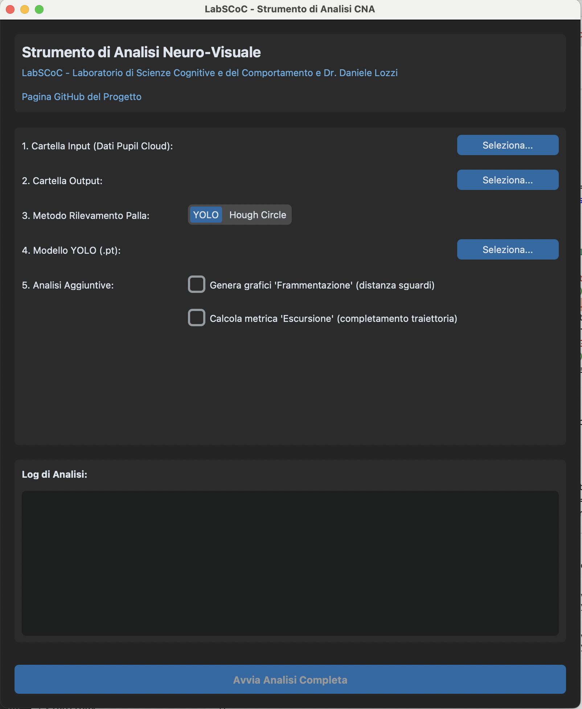

# Strumento di Analisi dei dati dell'Assessment Neurologico Computerizzato (CNA)

### LabSCoC (Laboratorio di Scienze Cognitive e del Comportamento) 

* **Sito Web Lab**: [labscoc.wordpress.com](https://labscoc.wordpress.com/) 
* **Repository GitHub**: [github.com/danielelozzi/neurological-assessment](https://github.com/danielelozzi/neurological-assessment) 
* **Concettualizzazione**: [Dr. Massimo Marano](https://scholar.google.it/citations?user=ugxMWiQAAAAJ&hl=it) 

Questo repository contiene una pipeline software completa per l'analisi del movimento oculare e della pupillometria in relazione al movimento di un cerchio su uno schermo.  L'intero processo è gestito da un'unica **interfaccia grafica (GUI)** che orchestra l'elaborazione dei dati, dal taglio dei video grezzi fino alla generazione di un report statistico e visuale completo. 

## 🎯 Obiettivo del Software

L'obiettivo è automatizzare e standardizzare l'analisi delle performance visuo-motorie.  Partendo dai dati grezzi, il software esegue i seguenti passaggi: 

1.  **Identifica i Segmenti di Test**: Utilizzando OCR, individua automaticamente i segmenti "fast" e "slow" tramite l'identificazione del countdown. 
2.  **Corregge la Prospettiva**: Applica una correzione basata su AprilTag, isolando l'area dello schermo. 
3.  **Rileva e Sincronizza**: Rileva il cerchio, tracciandone il movimento e sincronizzando i dati di sguardo e pupilla. 
4.  **Analizza e Visualizza**: Calcola metriche chiave (velocità, tempo sul target, diametro pupillare), esegue validazioni e scrive in sovrimpressione la direzione del movimento sui video finali. 
5.  **Genera l'Output**: Produce video, un report Excel dettagliato e grafici, incluse le analisi opzionali. 

## 📋 Prerequisiti

È necessario acquisire i dati con **Pupil Labs Neon**, usare gli **AprilTag** e processare la registrazione su **Pupil Cloud** con l'enrichment **Marker Mapper**.  La cartella scaricata da Pupil Cloud deve contenere: 

* `video.mp4` 
* `gaze.csv` 
* `world_timestamps.csv` 
* `surface_positions.csv` 
* **(Opzionale)** `pupil_positions.csv` o `3d_eye_states.csv` per l'analisi pupillometrica. 

## 🛠️ Installazione

Per eseguire il software, è necessario installare le dipendenze in un ambiente virtuale.  Sono forniti i passaggi per `conda` (Anaconda/Miniconda). 

### Anaconda/Miniconda

1.  **Crea e attiva l'ambiente conda** (sostituisci `cna-env` con il nome che preferisci): 
    ```bash
    conda create --name cna-env python=3.10 -y
    conda activate cna-env
    ```

2.  **Installa le librerie** usando `pip` all'interno dell'ambiente conda: 
    ```bash
    pip install -r requirements.txt
    ```

## 🚀 Utilizzo

1.  **Avvia la GUI**: `python main_gui.py` 
2.  **Configura l'Analisi**: 
    * **1. Cartella Input**: Scegli la cartella dati di Pupil Cloud. 
    * **2. Cartella Output**: Scegli dove salvare i risultati. 
    * **3. Metodo di Rilevamento**: YOLO (raccomandato) o Hough Circle. Se si utilizza il metodo Hough Circle, l'algoritmo adatta dinamicamente i parametri di ricerca in base alle dimensioni dello schermo (rilevate tramite AprilTag), aumentando notevolmente l'affidabilità.
    * **4. Modello YOLO**: Se necessario, carica il file del modello `.pt`. 
    * **5. Analisi Aggiuntive**: Seleziona le caselle per attivare le analisi opzionali. 
        * **Frammentazione**: Genera grafici sulla fluidità del movimento oculare.
        * **Escursione**: Attiva il calcolo delle metriche di performance dell'inseguimento (consistenza e qualità).
3.  **Avvia l'Analisi** con il pulsante principale. 

 

## 📊 Output del Progetto

* **`final_report.xlsx`**: Report Excel con metriche dettagliate e di riepilogo. 
    * Se l'analisi di escursione è attiva, i fogli di **Dettaglio** (`Dettagli_*`) includono due colonne:
        * `excursion_success` (`True`/`False`): Indica se lo sguardo ha raggiunto il bordo del pallino **almeno una volta** durante il trial.
        * `excursion_perc_frames`: Indica la **percentuale di frame** in cui lo sguardo si trovava oltre il bordo del pallino durante quel trial.
    * I fogli di **Riepilogo** (`Riepilogo_*` e `Riepilogo_Generale`) includono due metriche medie:
        * `escursione_successo_perc`: La percentuale di **trial di successo**, che misura la **consistenza** del movimento.
        * `escursione_perc_frames_media`: La media delle percentuali dei frame, che misura la **qualità e stabilità** dell'inseguimento.

* **`final_video_fast.mp4` / `final_video_slow.mp4`**: Video finali con overlay dello sguardo e della direzione del movimento. 

* **`output_final_analysis_analysis.csv`**: Dati grezzi calcolati, frame per frame.  Questo file include le coordinate normalizzate di sguardo e pallino, e la larghezza/altezza normalizzata del pallino (`ball_w_norm`, `ball_h_norm`) usate per i calcoli dinamici.

* **`cut_points.csv`**: Frame di inizio/fine dei segmenti, calcolati tramite OCR. 

* **Cartella `plots_and_heatmaps/`**: Contiene le visualizzazioni grafiche: 
    * **Heatmap** dello sguardo. 
    * Grafici dell'andamento della **pupillometria**. 
    * **(Opzionale) Analisi di Frammentazione**: Grafici (`fragmentation_plot_*.png`) che mostrano la distanza euclidea tra sguardi consecutivi, un indicatore della fluidità del movimento. 
    * **(Opzionale) Analisi di Escursione**: A differenza delle altre analisi, non produce un grafico ma arricchisce il report Excel con le metriche di performance descritte sopra, misurando la **consistenza** (successo dei trial) e la **qualità** (stabilità sui frame) dell'inseguimento.