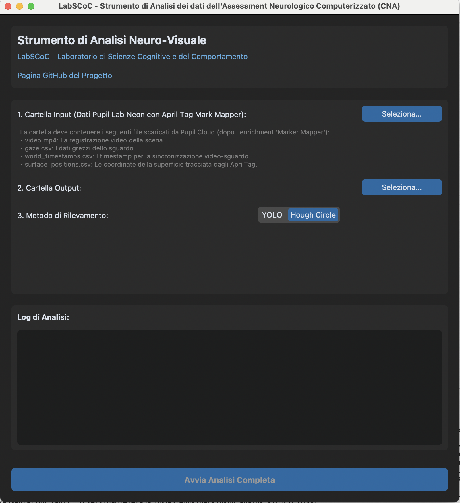

# Strumento di Analisi dei dati dell'Assessment Neurologico Computerizzato (CNA)
### LabSCoC (Laboratorio di Scienze Cognitive e del Comportamento) e Dr. Daniele Lozzi

- **Sito Web Lab**: [labscoc.wordpress.com](https://labscoc.wordpress.com/)
- **Repository GitHub**: [github.com/danielelozzi/neurological-assessment](https://github.com/danielelozzi/neurological-assessment)

Questo repository contiene una pipeline software completa per l'analisi del movimento oculare in relazione al movimento di una palla.

L'intero processo è gestito da un'unica **interfaccia grafica (GUI)** che orchestra l'elaborazione dei dati, dal taglio dei video grezzi fino alla generazione di un report statistico finale.

---

## 🎯 Obiettivo del Software

L'obiettivo è automatizzare e standardizzare l'analisi delle performance visuo-motorie. Partendo dai dati grezzi elaborati da Pupil Cloud, il software esegue i seguenti passaggi:
1.  **Identifica i Segmenti di Test**: Utilizzando il riconoscimento ottico dei caratteri (OCR), lo script individua automaticamente i frame di inizio e fine dei segmenti di interesse del test ("fast" e "slow").
2.  **Correzione Prospettica e Taglio**: Per ogni segmento, applica una correzione della prospettiva basata sugli AprilTag, isolando e raddrizzando solo l'area dello schermo.
3.  **Rilevamento e Sincronizzazione**: Rileva il cerchio e ne traccia il movimento all'interno dei video corretti, sincronizzando la posizione dello sguardo (gaze) per ogni frame.
4.  **Calcolo delle Metriche**: Calcola metriche chiave come la velocità dello sguardo, la velocità del cerchio, la percentuale di tempo in cui lo sguardo è correttamente sul cerchio e analizza la sequenza dei movimenti.
5.  **Generazione dell'Output**: Produce video finali con overlay per la revisione qualitativa, un report Excel dettagliato per l'analisi quantitativa e visualizzazioni grafiche (heatmap, grafici pupillometrici).

---

## 📋 Prerequisiti: Acquisizione e Preparazione dei Dati

Prima di utilizzare questo software, è necessario acquisire e preparare i dati seguendo una procedura specifica con gli strumenti di Pupil Labs.

1.  **Registrazione Video**: Utilizzare gli occhiali **Pupil Labs Neon** per registrare la sessione di test durante la proiezione del file PowerPoint.
2.  **Definizione della Superficie (AprilTag)**: Posizionare degli **AprilTag** ai quattro angoli dello schermo. Questi marcatori permettono al software di Pupil Labs di tracciare la superficie e mappare le coordinate dello sguardo su di essa.
    * Per maggiori dettagli, consultare la documentazione ufficiale: [**Pupil Labs Surface Tracker**](https://docs.pupil-labs.com/neon/neon-player/surface-tracker/).
3.  **Caricamento su Pupil Cloud**: Una volta completata la registrazione, caricare i dati sulla piattaforma **Pupil Cloud**.
4.  **Enrichment con Marker Mapper**: All'interno di Pupil Cloud, avviare l'enrichment **Marker Mapper**. Questo processo analizza il video, rileva gli AprilTag e genera il file `surface_positions.csv`.
    * Guida all'utilizzo del Marker Mapper: [**Pupil Cloud Marker Mapper**](https://docs.pupil-labs.com/neon/pupil-cloud/enrichments/marker-mapper/#setup).
5.  **Download dei Dati**: Al termine dell'enrichment, **scaricare l'intera cartella dei dati** dal progetto su Pupil Cloud. Questa cartella conterrà tutti i file necessari per l'analisi:
    * `video.mp4`: Il video registrato dalla camera di scena degli occhiali.
    * `gaze.csv`: Contiene i dati dettagliati dello sguardo.
    * `world_timestamps.csv`: Sincronizza ogni frame del video con un timestamp preciso.
    * `surface_positions.csv`: Contiene le coordinate della superficie tracciata tramite gli AprilTag.
    * **(Opzionale) `pupil_positions.csv` o `3d_eye_states.csv`**: Necessari per l'analisi pupillometrica. Includerli nel download se si desidera analizzare il diametro pupillare.

---

## 🛠️ Installazione

Per utilizzare il software, sono necessarie alcune librerie Python. È fortemente consigliato creare un ambiente virtuale.

1.  **Crea un ambiente virtuale**:
    ```bash
    python -m venv venv
    source venv/bin/activate  # Su Windows: venv\Scripts\activate
    ```

2.  **Installa le librerie richieste**:
    ```bash
    pip install customtkinter opencv-python pandas numpy matplotlib seaborn scipy easyocr ultralytics xlsxwriter
    ```

---

## 🚀 Utilizzo

L'intera pipeline viene eseguita tramite l'interfaccia grafica.

1.  **Avvia la GUI**:
    Esegui il seguente comando dalla directory principale del progetto:
    ```bash
    python main_gui.py
    ```
    

2.  **Configura l'Analisi**:
    * **1. Seleziona la Cartella Input**: Clicca su "Seleziona..." e scegli la **cartella scaricata da Pupil Cloud**.
    * **2. Seleziona la Cartella Output**: Clicca su "Seleziona..." e scegli una cartella dove verranno salvati **tutti i risultati**.
    * **3. Scegli il Metodo di Rilevamento**:
        * **YOLO**: Più moderno e accurato, ma richiede un file modello (`.pt`).
        * **Hough Circle**: Meno accurato, ma non richiede file esterni.
    * **4. Seleziona il Modello YOLO (se necessario)**: Se hai scelto YOLO, clicca su "Seleziona..." per caricare il file modello `.pt`.

3.  **Avvia l'Analisi**:
    Una volta configurati tutti i percorsi, il pulsante **"Avvia Analisi Completa"** diventerà cliccabile. Premilo per iniziare.

4.  **Monitora il Progresso**:
    Puoi seguire ogni fase dell'elaborazione nel riquadro **"Log di Analisi"** in tempo reale, inclusa la validazione della sequenza dei movimenti.

---

## 📊 Output del Progetto

Al termine dell'analisi, troverai i seguenti file nella cartella di Output che hai scelto:

* `final_report.xlsx`: Il report quantitativo finale con tutte le metriche chiave, suddiviso per protocollo ("fast", "slow") e direzione del movimento.
* `final_video_fast.mp4` / `final_video_slow.mp4`: I **video finali** dei segmenti "fast" e "slow". Questi video sono già **ritagliati sulla superficie dello schermo, corretti nella prospettiva e includono l'overlay dello sguardo** per una revisione qualitativa.
* `output_final_analysis_analysis.csv`: I dati grezzi, frame per frame, calcolati dalla pipeline (posizione della palla, posizione dello sguardo, ecc.).
* `cut_points.csv`: I frame di inizio/fine dei segmenti "fast" e "slow", calcolati tramite OCR.
* **Cartella `plots_and_heatmaps/`**: Contiene le visualizzazioni grafiche, incluse le heatmap dello sguardo e i grafici sulla pupillometria (se i dati erano disponibili).

---

## Citazione

*Se utilizzi questo script nella tua ricerca o nel tuo lavoro, ti preghiamo di citare le seguenti pubblicazioni:*

Lozzi, D.; Di Pompeo, I.; Marcaccio, M.; Ademaj, M.; Migliore, S.; Curcio, G. SPEED: A Graphical User Interface Software for Processing Eye Tracking Data. NeuroSci 2025, 6, 35. [https://doi.org/10.3390/neurosci6020035](https://doi.org/10.3390/neurosci6020035)

Lozzi, D.; Di Pompeo, I.; Marcaccio, M.; Alemanno, M.; Krüger, M.; Curcio, G.; Migliore, S. AI-Powered Analysis of Eye Tracker Data in Basketball Game. Sensors 2025, 25, 3572. [https://doi.org/10.3390/s25113572](https://doi.org/10.3390/s25113572)

---

*This tool is developed for the Cognitive and Behavioral Science Lab. For more information, visit [our website](https://labscoc.wordpress.com/).*